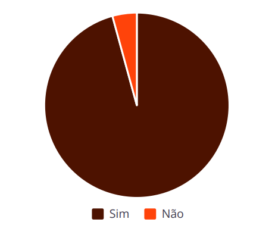
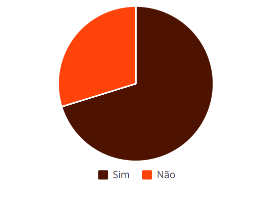

# Perfil dos Usuários de Plataformas de Apostas Online

## 15% da População Ativa  
Uma parcela significativa da população brasileira já realizou apostas  
online em 2024, indicando que o fenômeno transcende nichos  
específicos e se espalha por diferentes estratos sociais.  

## Gasto Médio  
Com um gasto médio de R$ 263 por mês, equivalente a cerca de 20%  
do salário mínimo, os usuários dedicam uma parte considerável de  
sua renda a essas atividades.  

## Jovens e Adolescentes  
Jovens entre 16 e 24 anos representam uma fatia preocupante,  
correspondendo a 30% dos apostadores, o que sugere uma  
vulnerabilidade dessa faixa etária.  

## Endividamento Generalizado  
Alarmantemente, 86% dos apostadores estão endividados, e 64% com  
o nome negativado, revelando um cenário de sérios problemas  
financeiros decorrentes das apostas.  

O perfil dos usuários de plataformas de apostas online no Brasil é um retrato preocupante, marcado pela alta prevalência de endividamento e  
pela participação crescente de jovens. Estes dados sublinham a necessidade urgente de intervenções que considerem as particularidades  
socioeconômicas e etárias, visando mitigar os impactos negativos dessas atividades financeiras.

---

# Insights da Pesquisa: Apostas Online e Consciência do "Tigrinho"

Pesquisamos 47 amigos (19-34 anos) sobre apostas online e o "Tigrinho". Nossos dados revelam percepções cruciais sobre jovens adultos no  
cenário digital.  
Você já ouviu falar do 'Fortune Tiger'?

Você já apostou online?  

Entrevistamos dois participantes do questionário que responderam "sim" à pergunta "Você já apostou online?". Um deles comentou que não vê mais graça em assistir futebol sem apostar, enquanto o outro completou que perdeu o interesse por qualquer esporte, como tênis e UFC, se não houver aposta envolvida. Um dos entrevistados, inclusive, destacou que estuda as metas de apostas e as enxerga como uma forma de obter uma renda extra.

