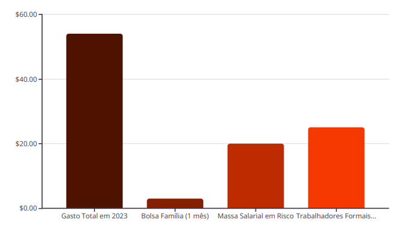

# Riscos e Vício: As Consequências Ocultas das Apostas

## Transtornos de Jogo  
Estudos indicam que 38% dos apostadores desenvolvem algum  
grau de transtorno relacionado ao jogo, caracterizando um  
problema de saúde pública.

## Adolescentes em Risco  
Ainda mais alarmante é o dado de que 55,2% dos adolescentes  
engajados em apostas apresentam risco de desenvolver vício, o  
que aponta para uma geração vulnerável.

## Prejuízo Financeiro  
O impacto financeiro é a consequência mais citada, afetando  
45% dos apostadores, resultando em perdas significativas e  
agravamento da situação econômica pessoal e familiar.

## Impacto nas Relações Pessoais  
Além dos danos financeiros, 30% dos usuários relatam que as  
apostas impactam negativamente suas relações pessoais,  
causando conflitos e desgaste familiar e social.

O vício em apostas digitais vai além do mero entretenimento, manifestando-se como um sério problema de saúde mental e social. Os riscos de desenvolver transtornos são altos, especialmente entre adolescentes, e as consequências se estendem a prejuízos financeiros substanciais e ao desgaste de relações interpessoais. É crucial reconhecer a gravidade desse cenário para promover políticas de prevenção e tratamento eficazes.

---

# Impacto Econômico e Social das Apostas no Brasil

O volume de dinheiro movimentado pelas apostas online no Brasil  
atinge patamares alarmantes, com bilhões de reais sendo  
direcionados para esse setor. A participação de beneficiários de  
programas sociais e de trabalhadores formais levanta sérias  
preocupações sobre a distribuição de renda e o potencial impacto na  
economia familiar e nacional. O risco de 20% da massa salarial ser  
comprometida por apostas ressalta a urgência de uma abordagem  
macroeconômica e social para o problema.
