# Análise dos Dados da Pesquisa sobre Segurança Digital

A pesquisa contou com a participação de 23 pessoas, de diferentes faixas etárias e níveis de escolaridade. A seguir, apresentamos a análise dos resultados com base nas respostas obtidas:

---

## 1. Perfil Sociodemográfico dos Participantes

A maioria dos respondentes está concentrada nas faixas etárias de 18 a 34 anos (aproximadamente 61%), evidenciando que o público pesquisado é predominantemente jovem adulto. Em termos de escolaridade, destaca-se que mais da metade possui nível superior incompleto ou completo, o que sugere um público com grau de instrução intermediário a elevado. Esse perfil demográfico pode influenciar diretamente na familiaridade com tecnologias digitais e, consequentemente, com os conceitos de segurança cibernética.

  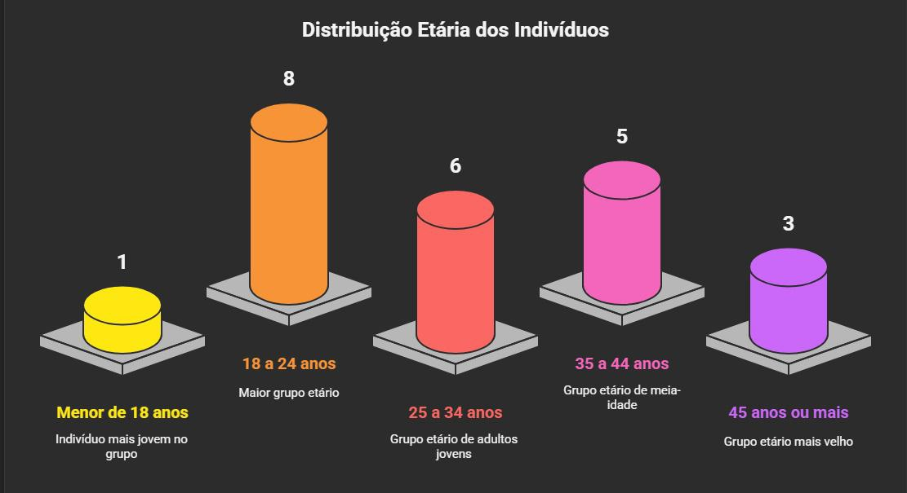

  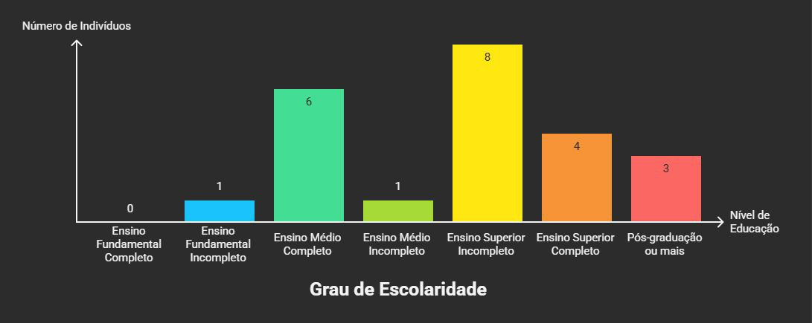

---

## 2. Hábitos de Consumo Online

Verificou-se que o comércio eletrônico faz parte da rotina dos participantes: cerca de 65% relataram realizar compras online com frequência ou muita frequência. Apenas dois afirmaram comprar raramente, e nenhum declarou nunca realizar compras pela internet. Esse dado evidencia uma exposição considerável dos respondentes a ambientes digitais de transação financeira, reforçando a importância de práticas seguras no uso dessas plataformas.

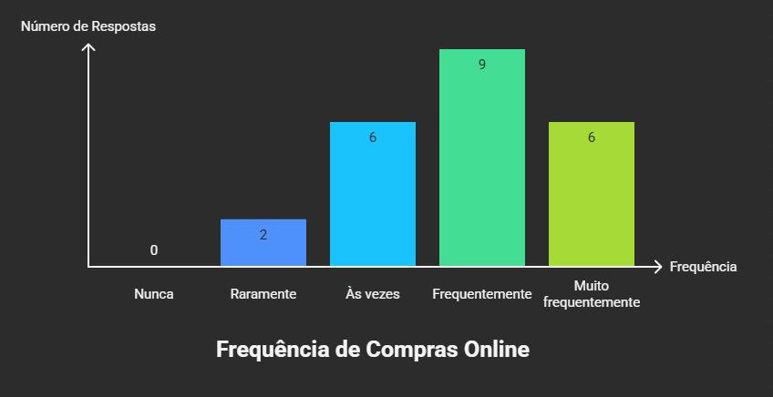

---

## 3. Nível de Informação sobre Segurança Digital

Em relação ao conhecimento sobre segurança digital, a maioria dos participantes (17 de 23) afirmou estar moderadamente ou bem informada. Apenas uma pequena parcela (3 respondentes) indicou ter pouco conhecimento, e nenhum se declarou totalmente desinformado. Embora os dados revelem uma percepção relativamente positiva quanto ao próprio nível de informação, é importante destacar que o dinamismo das ameaças digitais exige atualização constante de conhecimentos e práticas de proteção.

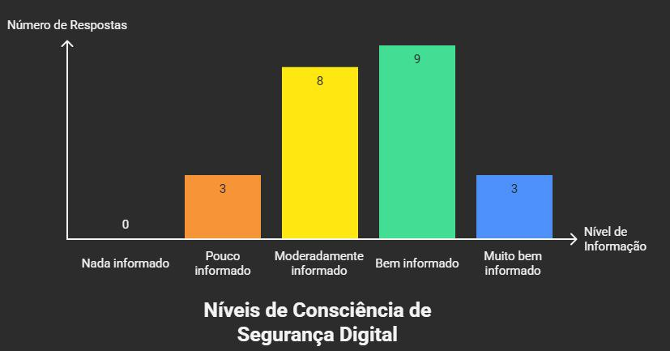

---

## 4. Comportamento de Compra Seguro

A segurança percebida em sites de compra também foi um fator de destaque. A maioria dos respondentes (91%) já deixou de concluir uma compra online por desconfiar da segurança do site, sendo que 30% relataram que essa situação ocorre com frequência. Tal comportamento revela um grau considerável de consciência crítica por parte dos usuários, embora possa também refletir uma certa desconfiança generalizada em relação a plataformas digitais.

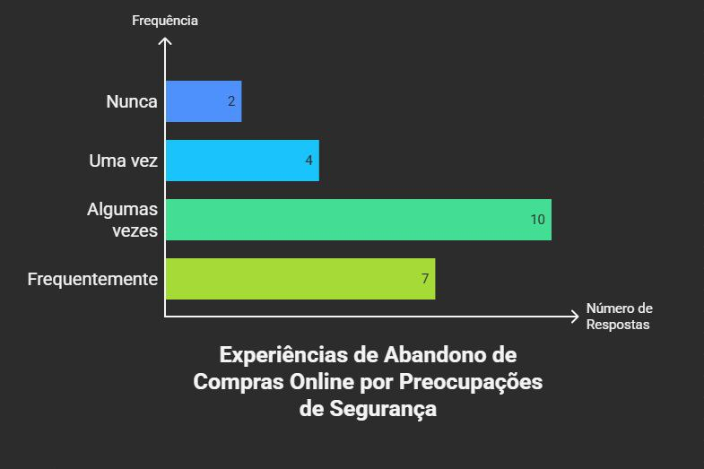

---

## 5. Privacidade nas Redes Sociais

A preocupação com a exposição de dados pessoais em redes sociais é evidente: cerca de 70% dos participantes demonstraram atenção frequente ou constante quanto a quem pode acessar suas informações, como fotos, localização e contatos. Esse dado demonstra uma percepção crescente sobre os riscos de compartilhamento excessivo nas mídias sociais e a busca por maior controle sobre a privacidade online.

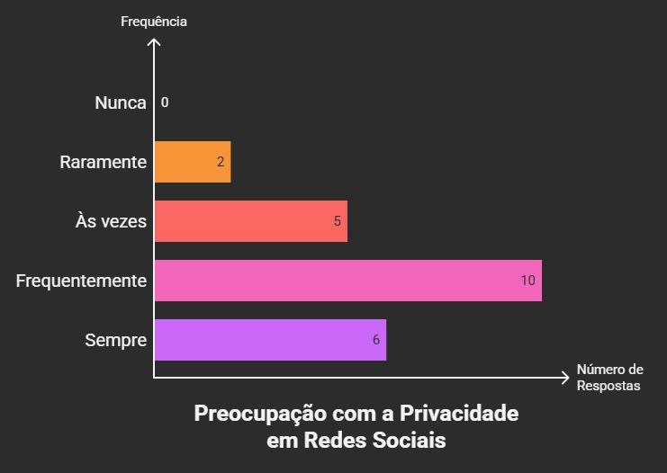

---

## 6. Senhas e Autenticação

No que se refere à criação e uso de senhas, apenas 10 dos 23 participantes relataram utilizar senhas fortes e diferentes com frequência ou sempre. A maioria restante reconheceu adotar tais práticas apenas ocasionalmente ou raramente, o que aponta para uma vulnerabilidade significativa nesse aspecto fundamental da segurança digital.

Quanto ao uso da autenticação em dois fatores (2FA), ferramenta considerada essencial para a proteção de contas online, a maioria (74%) declarou utilizar em pelo menos algumas contas, embora ainda exista um número expressivo de usuários (26%) que não adotam essa camada extra de segurança. A resistência à adesão completa pode estar associada a fatores como falta de conhecimento técnico ou busca por conveniência.

  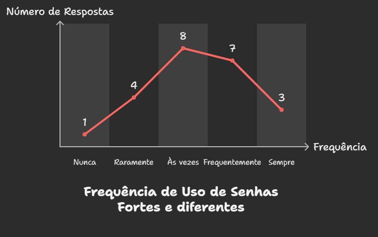

  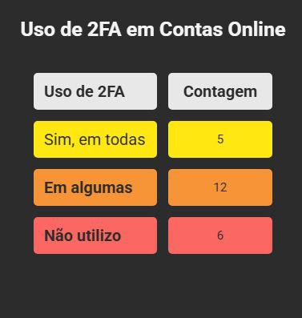

---

## 7. Verificação de Segurança em Sites

Metade dos respondentes afirmou verificar frequentemente ou sempre a presença de certificado de segurança (HTTPS) ao realizar compras online. Entretanto, a outra metade declarou fazer essa verificação apenas ocasionalmente ou raramente. Esses dados sugerem que, embora exista certo conhecimento sobre esse elemento básico de segurança, ainda há uma lacuna na incorporação desse hábito como prática padrão entre os usuários.

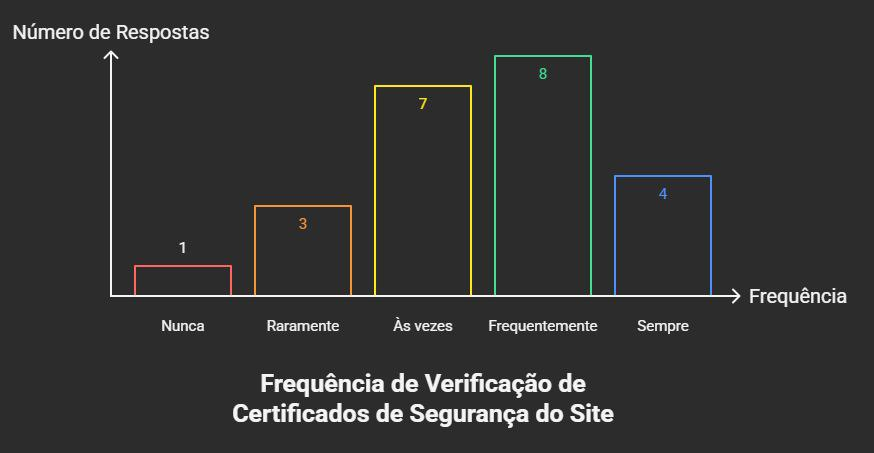

---

## 8. Exposição a Riscos

Um dado preocupante refere-se à exposição a links suspeitos: 15 dos 23 participantes admitiram já ter clicado em links duvidosos ao menos uma vez, sendo que dois o fizeram com frequência. Esse comportamento evidencia a necessidade de reforçar o senso crítico e a atenção diante de comunicações digitais, especialmente nas redes sociais e serviços de mensagens, onde ataques de engenharia social são comuns.

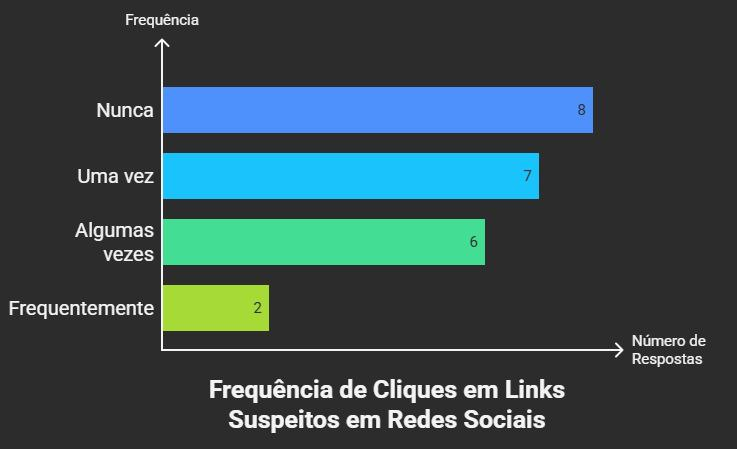

---

## 9. Educação Formal sobre Segurança Digital

A maioria dos participantes (65%) declarou nunca ter recebido orientações formais — como cursos, palestras ou treinamentos — sobre segurança digital. Essa ausência de formação estruturada compromete a difusão de boas práticas e reforça a importância de políticas públicas e iniciativas institucionais voltadas à educação digital, principalmente em ambientes escolares e no contexto corporativo.

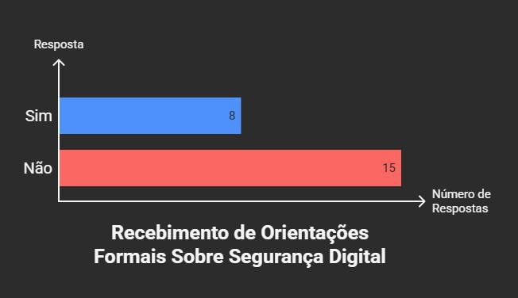

---

## 10. Medidas de Segurança Consideradas Importantes

Ao serem questionados sobre quais medidas consideram mais importantes para proteção digital, os participantes destacaram:

Uso de senhas fortes (12 votos),

Verificação de links antes de clicar (9 votos),

Autenticação em dois fatores (2FA) (8 votos).

Outras medidas, como evitar redes Wi-Fi públicas ou manter softwares atualizados, receberam menos destaque, sugerindo que ainda há desconhecimento ou subvalorização de aspectos igualmente relevantes para a cibersegurança.

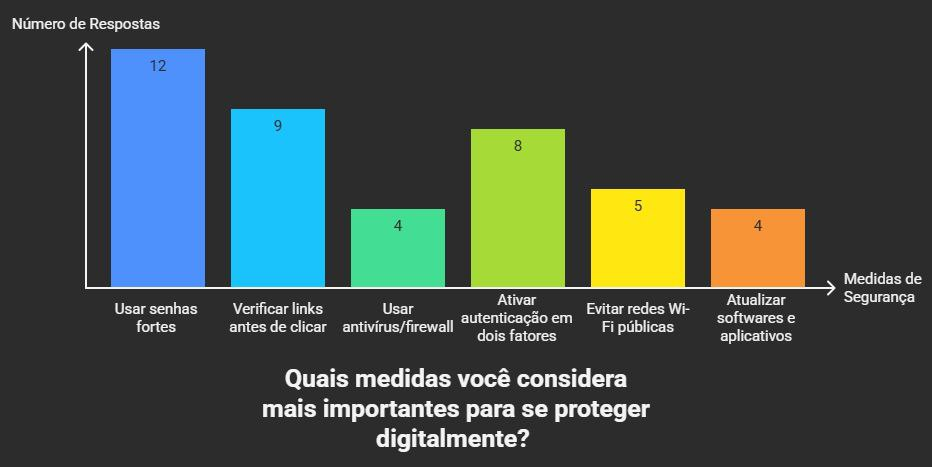